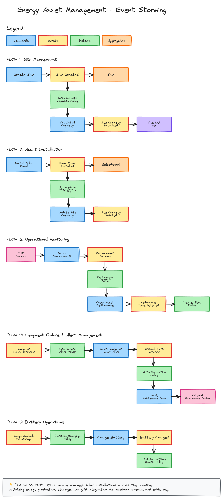

# 🌞 Energy Asset Management Portal

A comprehensive energy asset management platform for monitoring and maintaining solar power plants and storage batteries. Built with a .NET 8 backend and React + Carbon Design frontend, this project helps track asset performance, detect issues, and optimize energy usage — simulating the kind of tooling used in renewable energy operations.

*This project is an end-to-end demonstration of modern clean architecture and cloud-ready tooling in the context of renewable energy optimization.
It is actively evolving, and this README will be updated as planning, implementation, and features progress.*

## 🚀 Project Goals

- Build a realistic, production-quality backend following **Domain-Driven Design (DDD)** and **Clean Architecture**
- Implement **full CRUD operations** for managing energy sites, measurements, and alerts
- Provide a modern frontend dashboard to:
  - View site status and performance
  - Log and visualize measurements
  - Receive and manage alerts

## 📅 Status

🔧 In progress
  - ~~Define Domain layers and entities, API routes, Commands and Queries~~
  - ~~Wire up basic API to DB CRUD operation for Site~~, Assets, Alerts, Measurements
  - ~~Implement proper Logging and Error handling~~
  - ~~Sink logs to Dockerized Elastic-search and Kibana~~
  - ~~Template Factory pattern implementation for Entity management~~
  - Implement initial CQRS Commands and Queries leveraging Units of Work
  - Add Behaviors and validations
  - [ ... ]

## 🧩 Tech Stack Overview

### 🔧 Backend

- C# (.NET 8) with ASP.NET Core Web API
- Entity Framework Core with SQL Server
- Clean Architecture + CQRS using MediatR
- xUnit for unit and integration testing
- Swagger/OpenAPI for auto-generated API docs
- Structured logging to Elastic search with Kibana dashboard
- Prometheus metrics and Grafana monitoring dashboard

### 🖥️ Frontend

- React 18 with Vite
- Carbon Design System
- SCSS for styling
- Vitest and React Testing Library for component testing

### ☁️ Infrastructure & DevOps

- SQL Server
- Docker & Docker Compose for local orchestration
- GitHub Actions (planned) for CI/CD

### 🔧 Event Storming

As part of the Domain Driven Design approach, I wanted to do the exercise of going through an Event Storming session around the domain of Energy asset management. Even if I have pretty basics knowledge about this domain, here is a draft diagram of the outcome that leads to define some Aggregates for entities, Commands and Events.

